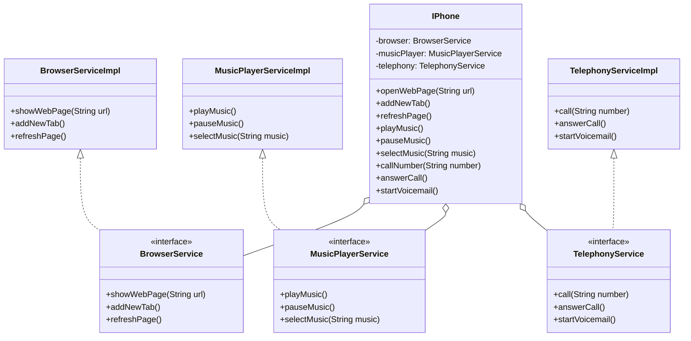

## 📱 Arquitetura de Serviços do IPhone

Este projeto demonstra o uso de **princípios de programação orientada a objetos** ao modelar a classe `IPhone`, que delega funcionalidades para três interfaces de serviço:

- `BrowserService`
- `MusicPlayerService`
- `TelephonyService`

Cada interface possui uma implementação concreta (`*Impl`), e a classe `IPhone` utiliza **agregação** para compor seu comportamento a partir dessas dependências externas. Isso promove **baixo acoplamento**, **modularidade** e segue o **Princípio da Inversão de Dependência (DIP)**.

### Funcionalidades implementadas

- **Navegação na web** (BrowserServiceImpl): exibir páginas, adicionar abas, atualizar páginas.
- **Reprodutor de música** (MusicPlayerServiceImpl): tocar, pausar e selecionar faixas.
- **Aparelho telefônico** (TelephonyServiceImpl): realizar chamadas, atender chamadas e iniciar correio de voz.

O design segue uma **separação clara de responsabilidades**, facilitando a extensão, os testes e a manutenção do código.

